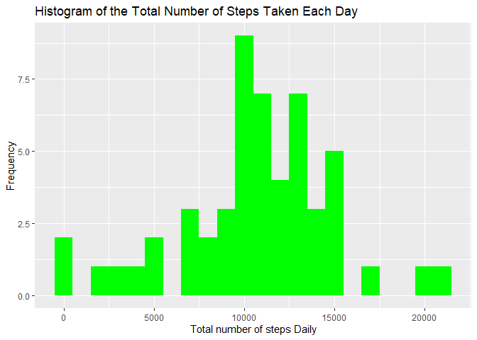
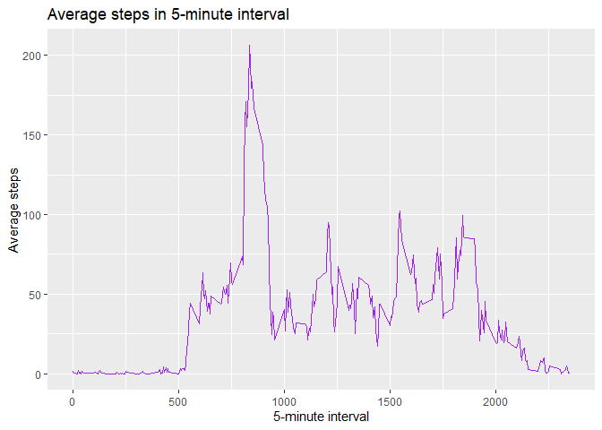
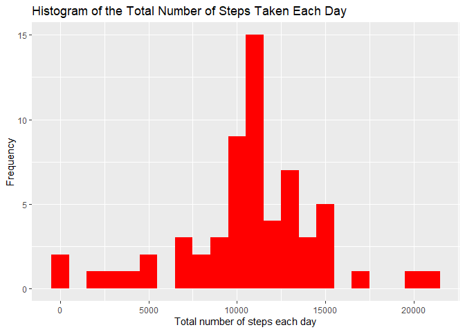
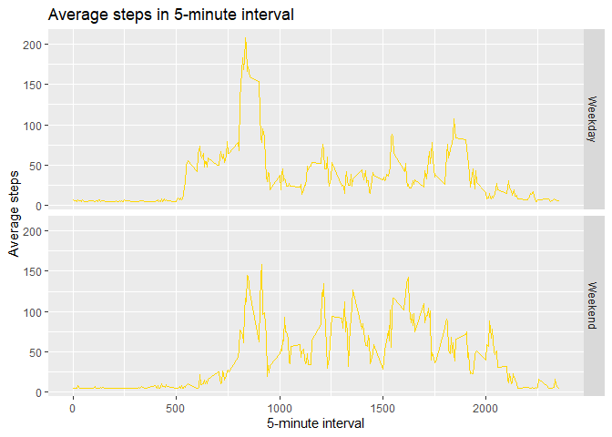

```r
library(knitr)
opts_chunk$set(echo = TRUE, results = TRUE, cache = TRUE)
```


```r
# Set working directory
# Download file
#setwd("C://Users//Olusola//Desktop//RR_WK2")
activityDataFileUrl <- "https://d396qusza40orc.cloudfront.net/repdata%2Fdata%2Factivity.zip"
activityDataZipFile <- "activity.zip"
if (!file.exists(activityDataZipFile)) {
        download.file(activityDataFileUrl, activityDataZipFile, mode = "wb")
}
# unzip downloaded file
activityDataFile <- "activity"
if (!file.exists(activityDataFile)) {
        unzip(activityDataZipFile)
}
```

## What is mean total number of steps taken per day?

1. Calculate the total number of steps taken per day


```r
# Read data into object variable dataFile
dataFile <- read.csv("activity.csv")
# Observe data using summary()
summary(dataFile)
```

```
##      steps            date              interval     
##  Min.   :  0.00   Length:17568       Min.   :   0.0  
##  1st Qu.:  0.00   Class :character   1st Qu.: 588.8  
##  Median :  0.00   Mode  :character   Median :1177.5  
##  Mean   : 37.38                      Mean   :1177.5  
##  3rd Qu.: 12.00                      3rd Qu.:1766.2  
##  Max.   :806.00                      Max.   :2355.0  
##  NA's   :2304
```


```r
# Change date from object of class factor to object of class date
dataFile$date <- as.Date(as.character(dataFile$date))
# Observe data again
summary(dataFile)
```

```
##      steps             date               interval     
##  Min.   :  0.00   Min.   :2012-10-01   Min.   :   0.0  
##  1st Qu.:  0.00   1st Qu.:2012-10-16   1st Qu.: 588.8  
##  Median :  0.00   Median :2012-10-31   Median :1177.5  
##  Mean   : 37.38   Mean   :2012-10-31   Mean   :1177.5  
##  3rd Qu.: 12.00   3rd Qu.:2012-11-15   3rd Qu.:1766.2  
##  Max.   :806.00   Max.   :2012-11-30   Max.   :2355.0  
##  NA's   :2304
```


```r
# Create data without NAs to compute mean later
dataFileNAs <- is.na(dataFile$steps)
cleanDataFile <- dataFile[!dataFileNAs,]
```


```r
# Use aggregate() to calculate the total number of steps taken per day
# I would have used tapply() but tapply() will convert dataFile from a data frame into an array(vector)
# I want to use ggplot() to make the histogram which only works with data frame 
stepsDaily <- aggregate(steps ~ date, dataFile, sum, na.rm = TRUE)
head(stepsDaily, 15)
```

```
##          date steps
## 1  2012-10-02   126
## 2  2012-10-03 11352
## 3  2012-10-04 12116
## 4  2012-10-05 13294
## 5  2012-10-06 15420
## 6  2012-10-07 11015
## 7  2012-10-09 12811
## 8  2012-10-10  9900
## 9  2012-10-11 10304
## 10 2012-10-12 17382
## 11 2012-10-13 12426
## 12 2012-10-14 15098
## 13 2012-10-15 10139
## 14 2012-10-16 15084
## 15 2012-10-17 13452
```

2. Make a histogram of the total number of steps taken each day


```r
library(ggplot2)
```

```
## Warning: package 'ggplot2' was built under R version 4.0.5
```

```r
H1 <- ggplot(data = na.omit(stepsDaily), aes(x = steps)) + 
        geom_histogram(fill = "green", binwidth = 1000) +
        xlab("Total number of steps Daily") +
        ylab("Frequency") +
        ggtitle("Histogram of the Total Number of Steps Taken Each Day")
print(H1)
```

<!-- -->

3. Calculate and report the mean and median of the total number of steps taken per day


```r
stepsDailyMean <- mean(stepsDaily$steps, na.rm = TRUE)
print(stepsDailyMean)
```

```
## [1] 10766.19
```

```r
stepsDailyMedian <- median(stepsDaily$steps, na.rm = TRUE)
print(stepsDailyMedian)
```

```
## [1] 10765
```

## What is the average daily activity pattern?

1. Make a time series plot (i.e. type="l") of the 5-minute interval (x-axis) and the average number of steps taken, averaged across all days (y-axis)


```r
average <- aggregate(steps ~ interval, dataFile, mean, na.rm = TRUE)
library(ggplot2)
timePlot <- ggplot(data = average, aes(x = interval, y = steps)) +
        geom_line(color = "purple") +
        xlab("5-minute interval") +
        ylab("Average steps") +
        ggtitle("Average steps in 5-minute interval")
print(timePlot)
```

<!-- -->

2. Which 5-minute interval, on average across all the days in the dataset, contains the maximum number of steps?

```r
names(average)[1] = "Intervals"
names(average)[2] = "Average_steps"
head(average, 15)
```

```
##    Intervals Average_steps
## 1          0     1.7169811
## 2          5     0.3396226
## 3         10     0.1320755
## 4         15     0.1509434
## 5         20     0.0754717
## 6         25     2.0943396
## 7         30     0.5283019
## 8         35     0.8679245
## 9         40     0.0000000
## 10        45     1.4716981
## 11        50     0.3018868
## 12        55     0.1320755
## 13       100     0.3207547
## 14       105     0.6792453
## 15       110     0.1509434
```

```r
intervalMax <- average[which.max(average$Average_steps),]
intervalMax
```

```
##     Intervals Average_steps
## 104       835      206.1698
```

## Imputing missing values

1. Calculate and report the total number of missing values in the dataset (i.e. the total number of rows with NAs)

```r
totalNas <- sum(dataFileNAs)
totalNas
```

```
## [1] 2304
```

2. Devise a strategy for filling in all of the missing values in the dataset. The strategy does not need to be sophisticated. For example, you could use the mean/median for that day, or the mean for that 5-minute interval, etc.

3. Create a new dataset that is equal to the original dataset but with the missing data filled in.

```r
missingValues <- is.na(dataFile)
table(missingValues)
```

```
## missingValues
## FALSE  TRUE 
## 50400  2304
```

```r
# Replace missing data with mean of steps
# Use the Hmisc package to impute mean i.e. install.packages("Hmisc"). Then load the package.
library(Hmisc)
```

```
## Warning: package 'Hmisc' was built under R version 4.0.5
```

```
## Loading required package: lattice
```

```
## Loading required package: survival
```

```
## Loading required package: Formula
```

```
## 
## Attaching package: 'Hmisc'
```

```
## The following objects are masked from 'package:base':
## 
##     format.pval, units
```

```r
imputing <- dataFile
imputing$steps <- impute(dataFile$steps, mean)
sum(is.na(imputing$steps))
```

```
## [1] 0
```

4. Make a histogram of the total number of steps taken each day and Calculate and report the mean and median total number of steps taken per day. Do these values differ from the estimates from the first part of the assignment? What is the impact of imputing missing data on the estimates of the total daily number of steps?


```r
sumImputing <- aggregate(steps ~ date, imputing, sum)
names(sumImputing)[1] = "date"
names(sumImputing)[2] = "Imputedsteps"
head(sumImputing, 20)
```

```
##          date Imputedsteps
## 1  2012-10-01     10766.19
## 2  2012-10-02       126.00
## 3  2012-10-03     11352.00
## 4  2012-10-04     12116.00
## 5  2012-10-05     13294.00
## 6  2012-10-06     15420.00
## 7  2012-10-07     11015.00
## 8  2012-10-08     10766.19
## 9  2012-10-09     12811.00
## 10 2012-10-10      9900.00
## 11 2012-10-11     10304.00
## 12 2012-10-12     17382.00
## 13 2012-10-13     12426.00
## 14 2012-10-14     15098.00
## 15 2012-10-15     10139.00
## 16 2012-10-16     15084.00
## 17 2012-10-17     13452.00
## 18 2012-10-18     10056.00
## 19 2012-10-19     11829.00
## 20 2012-10-20     10395.00
```


```r
library(ggplot2)
H2 <- ggplot(data = sumImputing, aes(x = Imputedsteps)) +
        geom_histogram(fill = "red", binwidth = 1000) +
        xlab("Total number of steps each day") +
        ylab("Frequency") +
        ggtitle("Histogram of the Total Number of Steps Taken Each Day")
print(H2)
```

<!-- -->


```r
# Mean of sumIputing
mean(sumImputing$Imputedsteps)
```

```
## [1] 10766.19
```

```r
# Median of sumIputing
median(sumImputing$Imputedsteps)
```

```
## [1] 10766.19
```


#### The mean and median of the original data with NAs are 10766.19 and 10765 respectively.
#### Likewise the mean and median of the imputed data without NAs are 10766.19 and 10766.19.
#### Thus, there is no real different between the two sets of data.

## Are there differences in activity patterns between weekdays and weekends?

### For this part the weekdays() function may be of some help here. Use the dataset with the filled-in missing values for this part.

1. Create a new factor variable in the dataset with two levels - "weekday" and "weekend" indicating whether a given date is a weekday or weekend day.

```r
imputing$dating <- ifelse(as.POSIXlt(imputing$date)$wday %in% c(0,6), "Weekend", "Weekday")
head(imputing)
```

```
##     steps       date interval  dating
## 1 37.3826 2012-10-01        0 Weekday
## 2 37.3826 2012-10-01        5 Weekday
## 3 37.3826 2012-10-01       10 Weekday
## 4 37.3826 2012-10-01       15 Weekday
## 5 37.3826 2012-10-01       20 Weekday
## 6 37.3826 2012-10-01       25 Weekday
```

2. Make a panel plot containing a time series plot (i.e.type="l") of the 5-minute interval (x-axis) and the average number of steps taken, averaged across all weekday days or weekend days (y-axis).

```r
meanImputing <- aggregate(steps ~ interval + dating, imputing, mean)
head(meanImputing)
```

```
##   interval  dating    steps
## 1        0 Weekday 7.006569
## 2        5 Weekday 5.384347
## 3       10 Weekday 5.139902
## 4       15 Weekday 5.162124
## 5       20 Weekday 5.073235
## 6       25 Weekday 6.295458
```


```r
# Use ggplot2
library(ggplot2)
panelPlot <- ggplot(data = meanImputing, aes(x = interval, y = steps)) +
        geom_line(color = "gold") +
        facet_grid(dating ~ .) +
        xlab("5-minute interval") +
        ylab("Average steps") +
        ggtitle("Average steps in 5-minute interval")
print(panelPlot)
```

<!-- -->
